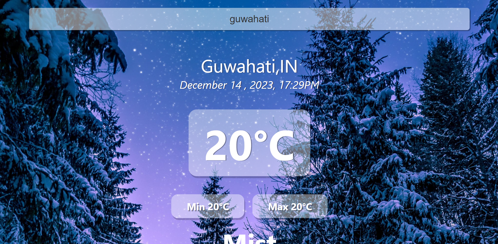
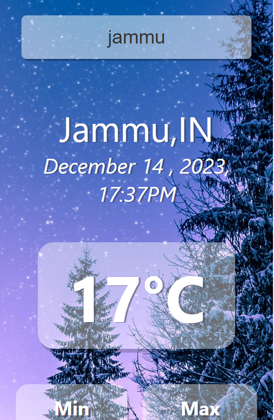

###Descriptrion
This is a weather application in which you are provided with a search bar to enter the name of the city whose temperature you wish to know. 
Additional information like date , time , pressure , humidity....etc are also provided .
Variation of the background according to temperature is also provided .
The frontend of the application is build using HTML , CSS and Reactjs. And the backend is taken from 3rd party (open weather api).

###Note
The graph was suppose to show real time data but those api's weren't available in the free pack . 

